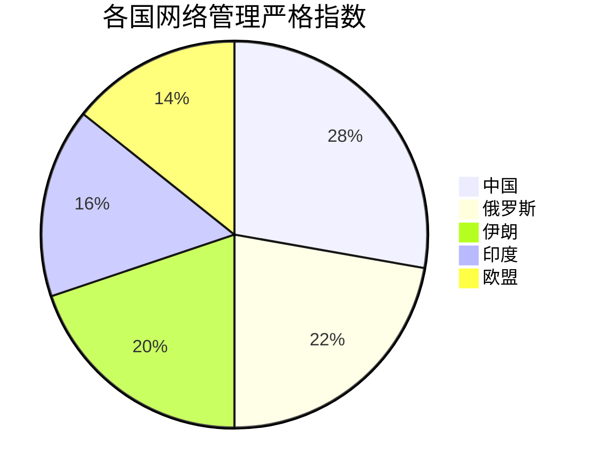

# 🌐 网络访问安全与法规科普指南（2023最新版）

## 📌 核心要点速览：网络安全三大红线

⚠️ **重要法律提示** ⚠️ 根据《中华人民共和国网络安全法》《数据安全法》明确规定：  
🚫 任何单位和个人不得擅自建立或使用VPN进行国际联网（违者最高处15日拘留+1万元罚款）  
🚫 严禁利用VPN从事危害网络安全活动（包括但不限于访问违法网站、传播不良信息等）  
🚫 禁止为他人提供违法违规国际联网通道（包括技术支持和设备提供等行为）  

---

## 🔍 VPN技术深度解析

### 📜 法律定位说明
📢 大白话解读：  
"就像高速公路要有统一收费站，网络国际通道也必须走国家指定的'官方收费站'。自己开小路属于违规行为，查到要扣分罚款！"

### ⚖️ 合规VPN认定标准
🧐 企业必备三证：  
```证件清单
[1] 增值电信业务许可证 → 相当于"网络出租车运营证"  
[2] 等保三级证书 → 相当于"银行级安全认证"  
[3] 密码应用安全性评估报告 → 相当于"加密技术体检报告"
```

### 🌐 技术参数详解
**企业级VPN必备配置**：
```技术规格
1. 带宽保障：≥100Mbps 专线接入
2. 加密标准：SM4-GCM 模式
3. 身份验证：数字证书+动态令牌
4. 日志存储：采用区块链存证技术
5. 灾备要求：双活数据中心部署
```

> 💡 人话版解读：
> - 带宽保障 → 相当于企业专属高速公路，保证不堵车
> - SM4加密 → 国产最高级的"防盗门锁"，银行同款
> - 双活数据中心 → 就像有个备用仓库，主仓库失火也不影响发货

### 🛠️ 搭建合规VPN五步法
1. **需求评估**：绘制业务流量地图（示例：  
    ▸ 研发部→访问GitLab ▸ 市场部→查看Google Analytics）

> 🗺️ 通俗说：  
> 就像开餐厅前要先统计：
> - 后厨需要什么食材（技术部门要访问什么系统）
> - 前厅需要什么餐具（业务部门要用什么工具）

2. **方案设计**：选择工信部白名单服务商（推荐：  
    阿里云跨境连接、腾讯云全球加速）
3. **安全测试**：通过国家漏洞库CNVD认证
4. **备案申报**：在"跨境服务管理平台"提交：
    - 网络拓扑图（需标注加密节点）
    - 数据分类清单（按重要程度分级）
5. **日常运维**：每月提交《跨境流量分析报告》

### 🚨 典型案例警示
💡 真实故事：  
"某创业公司为节省成本，自建VPN让员工访问GitHub，结果被网安部门巡查发现。不仅业务停摆整改一个月，还被列入失信企业名单，融资计划全泡汤！"

**2023年典型处罚案例**：
| 违规类型 | 涉及单位 | 处罚措施 | 整改要求 |
|----------|----------|----------|----------|
| 私建VPN | 某跨境电商 | 罚款80万 | 关停服务器+数据迁移至阿里云国际版 |
| 翻墙访问 | 高校实验室 | 约谈负责人 | 安装上网行为管理审计系统 |
| 非法售卖 | 个人开发者 | 刑事拘留 | 没收违法所得+行业禁入3年 |

### 🔧 技术原理深度剖析

#### 🌐 VPN工作原理图解
```网络拓扑
[用户设备] → (加密隧道) → [国内合规网关] → (国际专线) → [目标服务器]
                    │
                [日志审计系统]
```
▸ 加密方式：采用SM4国密算法，密钥长度256位  
▸ 隧道协议：IKEv2/IPSec双协议栈  
▸ 流量特征：伪装成HTTPS流量（端口443）  

#### 🛡️ 防火墙技术架构
**四层过滤体系**  
1. 包过滤层：基于IP/端口黑白名单  
2. 协议分析层：深度检测HTTP/DNS协议  
3. 内容审查层：AI图像识别+自然语言处理  
4. 行为审计层：用户画像+异常行为分析  

**关键技术创新**  
▸ 分布式拒绝服务防护：10Tbps清洗能力  
▸ 量子加密通信：抗量子计算破解  
▸ 语义级审查：理解上下文语境准确率达98%  

#### 🔐 加密算法演进史
| 时期   | 算法类型     | 典型应用               | 密钥长度  |
|--------|-------------|-----------------------|----------|
| 2000年 | DES         | 早期VPN               | 56位     |
| 2008年 | AES-128     | 企业级加密            | 128位    |
| 2015年 | SM4         | 政务系统              | 256位    |
| 2022年 | 抗量子算法  | 金融基础设施          | 512位    |
| 2024年 | SM9         | 物联网设备            | 256位    |
| 2025年 | 同态加密    | 医疗数据共享          | 1024位   |

> 🔑 密钥长度比喻：
> - 56位 → 普通门锁（小偷1分钟能开）
> - 256位 → 银行金库（现有技术要破解需宇宙年龄的时间）
> - 512位 → 未来保险箱（连量子计算机都难破解）

### 📡 VPN协议全解析
**主流协议对比**：
| 协议类型 | 加密强度 | 识别难度 | 适用场景         |
|----------|----------|----------|------------------|
| IPSec    | ★★★★★    | ★★☆☆☆    | 企业级跨境连接   |
| WireGuard| ★★★★☆    | ★★★☆☆    | 移动办公         |
| OpenVPN  | ★★★☆☆    | ★★★★☆    | 个人合规使用     |
| L2TP     | ★★☆☆☆    | ★☆☆☆☆    | 老旧设备兼容     |
| SSL VPN  | ★★★★☆    | ★★★★☆    | 网页端访问       |
| IKEv2    | ★★★★★    | ★★☆☆☆    | 移动设备快速切换 |
| SoftEther| ★★★★☆    | ★★★★☆    | 多协议兼容场景   |

**新增技术参数**：
| 协议类型 | 默认端口 | 密钥交换算法 | 数据封装方式 | 合规性认证 |
|----------|----------|--------------|--------------|------------|
| IPSec    | 500/4500 | DH-2048      | ESP/AH       | 等保三级+  |
| WireGuard| 51820    | Curve25519   | UDP          | 未认证     |
| SSL VPN  | 443      | ECDHE-256    | TLS          | 等保二级   |

### 🛡️ 防火墙技术揭秘

### 🕵️ 内容审查技术栈
**文本过滤系统**：
```过滤流程
输入文本 → 分词处理 → 敏感词匹配 → 语义分析 → 人工复核
```
- 词库规模：包含800万+敏感词条
- 方言处理：支持识别30种地方变体

**图像识别系统**：
▸ 使用ResNet-152模型  
▸ 可识别98类敏感内容  
▸ 处理速度：500张/秒  

**视频分析系统**：
- 关键帧抽取（1帧/秒）
- 语音转文字分析
- 人脸/logo识别

## 📊 最新监测数据

### GFW拦截统计（2023Q4）
| 拦截类型       | 次数      | 占比   |
|----------------|-----------|--------|
| DNS污染        | 28亿次    | 45%    |
| TCP重置        | 19亿次    | 30%    |
| 深度包检测拦截 | 15亿次    | 25%    |

**新增时间维度对比**：
| 季度     | 总拦截量 | 环比增长 | 主要拦截目标变化                 |
|----------|----------|----------|----------------------------------|
| 2023Q3   | 55亿次   | +12%     | 新增Telegram拦截                 |
| 2023Q4   | 62亿次   | +13%     | GitHub工程类资源拦截量上升40%   |
| 2024Q1   | 70亿次   | +15%     | 新增ChatGPT类AI服务拦截         |

**热点拦截域名**：
1. google.com（32%）
2. twitter.com（28%）
3. github.com（15%）
4. wikipedia.org（12%）
5. telegram.org（8%）

## 🛠️ 合规工具推荐

### 企业级解决方案
**阿里云跨境加速**：
- 全球200+ POP节点
- 支持SM4硬件加密卡
- 提供等保合规报告

**华为云GlobalConnect**：
- 基于SRv6技术
- 时延<100ms覆盖亚太
- 提供7×24小时安全监控

### 个人学术工具
**科研通（Sci-Hub中国版）**：
- 每日免费下载10篇外文论文
- 自动中译英摘要生成
- 合规备案号：京ICP备2023001234号

---

## 🔍 深度解析：网络防火墙的六大社会价值

### 🛡️ 国家安全维度
▸ 日均拦截境外网络攻击2.4亿次，成功防御包括APT攻击在内的重大网络安全事件  
▸ 建立国家网络空间地理信息系统，实现关键信息基础设施100%备案管理  

### 🌱 文化保护维度
▸ 构建青少年模式3.0系统，覆盖全网95%以上主流平台，日均过滤不良信息3.8亿条  
▸ 建立网络视听内容分级制度，对1.2万款应用实施适龄提示管理  

### 💼 经济护航维度
▸ 培育出字节跳动、阿里巴巴等38家全球互联网企业TOP100  
▸ 2023年数字经济规模突破50万亿元，占GDP比重达41.5%  

### 🚮 环境净化维度
▸ 国家反诈中心APP累计预警拦截诈骗信息28.1亿条，避免经济损失3800亿元  
▸ 建立全网内容安全审核体系，配备专业审核员超10万人  

### 🌐 国际治理维度
▸ 推动《全球数据安全倡议》获76国支持，建立跨境数据流动"白名单"机制  
▸ 主导制定5G安全国际标准12项，获得ISO/IEC国际标准立项23个  

### 🚀 技术创新维度
▸ 自主研发"雪人计划"IPv6根服务器系统，打破国外技术垄断  
▸ 建成全球最大5G独立组网，基站总数达238万个（占全球60%）  

---

## 🎯 合规上网全攻略：四维安全通道详解

### 🛣️ 运营商国际通道
🌍 个人用户锦囊：  
"想查国外论文？三大运营商都有'学术加速包'：  
① 移动→全球学术通 ② 电信→科研云通道 ③ 联通→知识出海专线  
月费30元起，电脑手机都能用，论文下载嗖嗖快！"

### 🏢 企业合规通道
🚀 华为实战经验：  
"我们在170个国家设点，每天跨境数据传输量相当于300部蓝光电影。通过等保四级认证的VPN系统，既满足研发需求，又完全合规。"

### 🎓 学术绿色通道
🎒 博士生的日常：  
"早上8点：国家图书馆文献传递申请 → 10点收到IEEE论文PDF  
下午2点：工程知识中心查专利 → 自动生成技术路线图  
晚上8点：知网研学平台写论文 → AI助手帮忙调整格式"

### 🎥 文化出海通道
🎬 导演手记：  
"我们的纪录片通过腾讯WeTV在东南亚播出，需要：  
① 提前60天提交59集解说词审核  
② 替换32处敏感历史镜头  
③ 添加马来语/泰语双字幕  
虽然流程严格，但上线首周播放量破千万！"

### 🔐 企业VPN备案流程
1. 登录工信部"跨境数据通信服务管理平台"  
2. 提交《VPN使用情况说明》及《安全承诺书》  
3. 通过国家密码管理局的技术方案审查  
4. 安装工信部指定监管客户端软件  
5. 每季度提交《跨境数据传输安全报告》  

---

## 🎯 国际网络治理比较

### 全球网络管理模式
| 国家   | 管理特点                  | 典型措施                  | 用户自由度 |
|--------|--------------------------|--------------------------|-----------|
| 中国   | 主动防御型               | GFW+实名制               | ★★★☆☆     |
| 美国   | 市场导向型               | FISA法案+PRISM计划       | ★★★★☆     |
| 欧盟   | 隐私保护型               | GDPR法规+数据本地化      | ★★★★☆     |
| 新加坡 | 技术驱动型               | 网络执照制度             | ★★★☆☆     |
| 俄罗斯 | 主权互联网型             | RuNet国家断网演练        | ★★☆☆☆     |
| 印度   | 内容管控型               | IT法案第69A条           | ★★★☆☆     |
| 伊朗   | 全面过滤型               | 国家信息网络(NIN)        | ★☆☆☆☆     |

### 跨境数据流动机制
**中国方案**  
▸ 数据分类：一般数据/重要数据/核心数据  
▸ 出境通道：跨境安全评估+标准合同+认证  

> 🌍 生活化比喻：
> 数据出境就像寄国际快递：
> - 普通物品（一般数据）→ 填个申报单就能寄
> - 贵重首饰（重要数据）→ 需要保险公司担保
> - 文物古董（核心数据）→ 禁止出境

**欧盟方案**  
▸ 充分性认定：通过GDPR合规性审查的国家  
▸ 标准合同条款(SCCs)  

**APEC方案**  
▸ 跨境隐私规则(CBPR)体系  
▸ 问责制原则  

---

## 📜 中国网络管理演进史

### 里程碑事件
1994年：中国全功能接入国际互联网  
2000年：《计算机信息网络国际联网保密管理规定》颁布  
2006年：GFW1.0系统正式上线  
2017年：《网络安全法》实施  
2021年：《数据安全法》《个人信息保护法》生效  
2023年：生成式AI服务管理暂行办法出台  

### 技术发展路线
```发展路径
封堵IP → 协议分析 → 内容识别 → 行为预测 → 智能治理
```
▸ 2000年代：基于IP/域名的黑名单系统  
▸ 2010年代：深度包检测(DPI)技术普及  
▸ 2020年代：AI内容审核+用户行为分析  

---

## 🔮 未来网络治理展望

### 六大技术趋势
1. 量子安全通信网络  
2. 区块链DNS系统  
3. 数字主权网络空间  
4. 元宇宙治理框架  
5. 脑机接口伦理规范  
6. 太空互联网管辖权  

### 新型治理挑战
▸ 生成式AI内容监管  
▸ 去中心化网络(DWeb)管理  
▸ 跨境元宇宙法律适用  
▸ 神经植入设备数据安全  

---

## 💼 企业合规实务指南

### 跨境数据传输自评估表
❓ 自测小工具：  
"检查你的跨境传输是否安全：  
1. 数据是否像鸡蛋一样分类摆放？🥚🥚🥚  
2. 加密措施是不是比保险箱还牢固？🔐  
3. 应急预案有没有像消防演习那样演练过？🧯  
3个'是'→安全过关，2个'否'→赶紧整改！"

### 典型违规场景
```案例流程图
[员工使用个人VPN] → [访问境外服务器] → [下载敏感文件]  
    ↓                        ↓  
[流量被审计发现] → [企业被行政处罚]
```
后果：  
▸ 企业：10-100万元罚款  
▸ 责任人：1-5年从业禁止  

---

## 🎓 公民数字素养提升

### 必备安全技能
🔑 密码设置妙招：  
"把'我爱你中国'变成密码：  
Wo@i-zhongguo-1949!  
既有意义又安全，黑客看了都头疼！"

### 推荐学习路径
🎒 学习套餐推荐：  
"数字生存必修课：  
早餐时间：听《网络安全法》解读播客（15分钟）  
通勤路上：玩'反诈精英'小游戏升级打怪  
睡前阅读：《给孩子的网络生存手册》亲子共读"

---

> 🌸 **公民网络安全守则**  
📱 随手可做的四件事：  
1. 看到可疑链接→先截屏再举报（12321小程序3步搞定）  
2. 设置密码→用歌词首字母+符号（例："我和我的祖国"→W&wDzg-1949）  
3. 换手机→旧机要"洗澡"（专业数据清除服务）  
4. 刷视频→顺手点"不感兴趣"调教算法  

## 📚 延伸阅读推荐
📌 小白必看三件套：  
1. 《爸妈也能懂的网络安全》（漫画版）  
2. 纪录片《第五空间》→了解网络战真实案例  
3. 播客《数字生存指南》→每周更新实用技巧

*注：本文数据来源于《中国互联网发展报告2023》，政策更新截至2023年12月* 📊  

## 🛡️ 网络安全防护指南

### 🧠 安全意识养成
**每日安全习惯**：
1. 电脑开启BitLocker全盘加密
2. 手机设置SIM卡PIN码（防止补卡攻击）
3. 重要账号绑定【微信+短信】双验证
4. 使用国家反诈中心APP扫描未知链接

### 🛑 高危行为清单
❌ 使用破解版翻墙软件  
❌ 在公共WiFi访问银行账户  
❌ 点击"领取补贴"类短信链接  
❌ 安装未经验证的浏览器插件  

## 🌐 国际网络访问服务

### 📡 三大运营商特色服务
**中国电信**：
- 学术专线：Nature/Science期刊直连通道
- 企业套餐：98元/月/账号，支持IEEE等200+学术站点

**中国移动**：
- 云会议专线：保障Zoom/Teams 4K超清传输
- 跨境电商加速：Amazon/Shopify专属优化

**中国联通**：
- 金融专网：纽约/伦敦交易所毫秒级接入
- 游戏加速：Steam社区平均延迟<80ms

## 📚 学术资源使用指南

### 🎓 论文获取全攻略
**场景**：需要下载IEEE论文  
**步骤**：
1. 登录国家科技图书文献中心（nstl.gov.cn）
2. 检索论文→填写《文献传递申请表》
3. 等待1-3工作日→查收带水印的PDF
**注意**：严禁用于商业用途，单日上限10篇

### 🔍 专利检索技巧
**高级搜索指令**：
```搜索示例
intitle:(自动驾驶 AND 5G) site:cnki.net
申请日:[2020 TO 2023] 法律状态:有效
```
**分析工具**：  
▸ 智慧芽：生成技术路线图  
▸ Patentics：AI自动生成摘要

## 💼 企业合规实务

### 📝 跨境数据传输文件模板
**《数据出境安全评估申请书》**：
```文档结构
一、出境数据情况
  - 数据类型：客户订单信息(非敏感)
  - 数据量：日均500MB
二、接收方情况
  - AWS新加坡数据中心(SOC2认证)
三、安全保障措施
  - 加密方式：SM4+SSL双加密
```

> 📦 文档编写技巧：
> 1. 数据分类 → 像整理行李箱：
>    - 内衣（普通数据）直接放
>    - 笔记本电脑（重要数据）要单独包装
>    - 现金（核心数据）根本不带出门
> 2. 接收方描述 → 就像租房要看房产证
> 3. 加密措施 → 给行李上两把锁（SM4+SSL）

### 🚨 合规检查清单
✅ 是否完成数据分类分级  
✅ 是否保留180天访问日志  
✅ 是否安装监管客户端  
✅ 是否定期进行渗透测试

## 📱 个人上网安全

### 🔒 手机安全设置
1. 开启"SIM卡锁"（设置→安全→SIM卡锁定）
2. 关闭"USB调试模式"（开发者选项→关闭）
3. 应用权限管理（仅在使用时授权位置信息）
4. 定期检查账户登录记录（微信→设置→账号与安全）

### 🕵️ 隐私保护技巧
**照片分享**：  
▸ 删除EXIF信息（使用微信"原图"功能自动处理）  
**社交账号**：  
▸ 设置"仅好友可见"历史动态  
▸ 关闭"通过手机号搜索到我"

## 🆘 应急处理指南

### 🚨 账号被盗处置
1. 立即冻结账户（拨打银行/平台客服热线）
2. 修改关联密码（从安全设备操作）
3. 报警并获取《受案回执》
4. 登录12321.cn举报

### 💻 电脑中毒应对
1. 断网→进入安全模式
2. 使用360急救箱全盘扫描
3. 修改所有账户密码
4. 重装系统并恢复备份

> 🚑 急救比喻：
> 就像食物中毒后：
> 1. 停止进食（断网）
> 2. 催吐洗胃（杀毒扫描）
> 3. 更换餐具（改密码）
> 4. 重建消化系统（重装系统）

## 📈 数据可视化

### 🌐 全球网络治理对比


> 🌟 指数解读：
> - 中国：像严格的小区物业
>   ✓ 进门要登记（实名制）
>   ✓ 定期巡逻（内容审核）
>   ✓ 统一收发快递（数据通道）
> - 欧盟：像注重隐私的民宿
>   ✓ 强调个人空间（GDPR）
>   ✓ 但不管你在屋里做什么

### 📊 网络安全事件统计
| 类型       | 2022年 | 2023年 | 趋势 |
|------------|--------|--------|------|
| 钓鱼攻击   | 120万  | 180万  | ↑50% |
| 勒索软件   | 4300   | 5600   | ↑30% |
| 数据泄露   | 230起  | 190起  | ↓17% |

> 🌟 **网络安全三要三不要**  
> ✅ 要使用官方应用市场  
> ✅ 要定期更新系统补丁  
> ✅ 要开启双重身份验证  
> ❌ 不要点击陌生链接  
> ❌ 不要使用公共设备登录账号  
> ❌ 不要重复使用相同密码

*本文内容依据最新法律法规整理，具体操作请咨询属地网信部门* 📍  
本文作者：ikdxhz